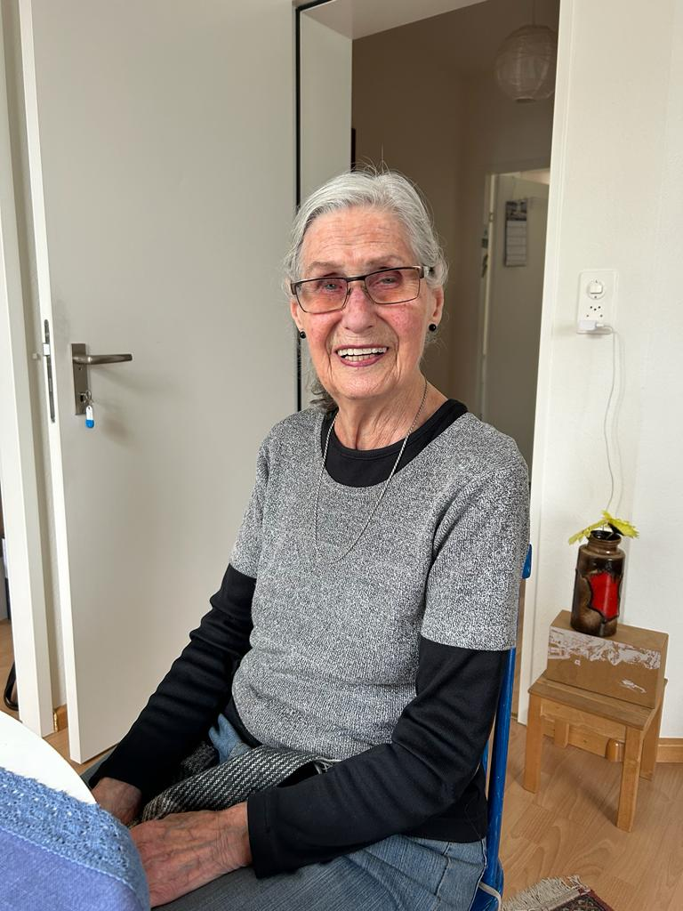

+++
title = "Eine Reise ans andere Ende der Welt"
date = "2024-03-13"
draft = false
pinned = false
tags = ["Auswandern", "Migration", "Australien", "Melbourne", "Autorin", "Bücher"]
image = "img_1974.png"
description = "In den 60er Jahren zog die Schweizerin Marlene Derlet, mit ihrem Partner Anton, nach Australien. Sie reiste auf dem Migrantenschiff \"Johann van Olden Barnewelt\" und arbeitete in einer Buchhandlung sowie später als Schriftstellerin. Ihre Bücher \"Talking up a Storm\" und \"Invisible Woman of Prehistory\" zeigen ihre Erfahrungen und feministischen Ansichten. Marlene erzählt von der Freundlichkeit der Australier und teilt die Geschichte über ihren ersten Cappuccino in Melbourne und ihre Anpassung an ihr neues Leben."
footnotes = ""
+++


Wie fühlt es sich an, in ein Land zu migrieren, das man zuvor noch nie betreten hat? In den frühen 60ern begaben sich Marlene Derlet und ihr Partner Anton Derlet auf eine Reise in das Down-Under. Im Interview teilt sie ihre Erfahrungen über die Faszination, aber auch die Herausforderungen, ein vollkommen neues Land zu bereisen.



*Emma Derlet*



Marlene Derlet ist am 14.09.1936 in der Schweiz geboren. Ihre Mutter kommt aus Frankreich. In Melbourne Stuidiert Marlene und später unterrichtet sie auch and der Universität.



Die Mittagssonne taucht das geräumige Wohnzimmer in goldenes Licht. Marlene Derlet nimmt Platz auf einem braunen Ledersessel und erwartet gespannt die Fragen, die ich ihr in Kürze stellen werde. Die Atmosphäre wirkt ruhig und gelassen. Das Smartphone findet seinen Platz auf dem Beistelltisch, der Startbutton wird gedrückt.

**Kannst du deine Motivationen teilen, warum du von der Schweiz nach Australien gezogen bist?**

Anton, mein damaliger Ehemann, hatte Freunde, die Verwandte in Australien haben, und sie haben darüber gesprochen, wie schön es dort war. Ich wollte schon immer irgendwohin gehen, und er wollte ins Ausland, also war Australien damals die beste Option. Ich persönlich wollte nach Kanada gehen, aber wir haben uns dann dafür entschieden.

**Wie war die Reise nach Australien, Melbourne?**                                         

Wir sind von Genua, also aus Italien, nach Australien gezogen. Mit dem Schiff, das hieß Johann van Olden Barnevelt. Es war ein Migrantenschiff und es legte am 18. April 1960 in Italien ab. Und wir kamen am 16. Mai 1960 in Melbourne an. Ich war oft seekrank. Ich wurde schon immer krank auf der See, sogar hier in der Schweiz, als ich ein kleines Kind war. Selbst jetzt mag ich keine Schiffe. Ich liebe Schiffe, aber sie machen mich leider krank.

> «Ich mochte es, in Australien zu leben, weil die Leute irgendwie so anders waren, freundlicher auf eine Weise, und auch die Nachbarn. Viel freundlicher als die Schweizer.»
>
> *Marlene Derlet*

**Was habt ihr am ersten Tag gemacht, als ihr angekommen seid?**

Die Person, die uns abgeholt hat, war glaube ich, Pole oder Italienern. Ich kann mich nicht genau daran erinnern. Aber sie sagte zu uns, dass wir jetzt zuerst einen Kaffee trinken. Das war der erste Cappuccino, der in ganz Australien gemacht wurde. Und so haben wir dort unseren Kaffee bekommen.

**Als was hast du gearbeitet?**

Ich war in einer Buchhandlung, und das habe ich meistens den ganzen Tag gemacht. Dann habe ich natürlich später angefangen zu studieren. Anton hat zuerst in einer Autofabrik gearbeitet und dann seine eigenen Fabriken gehabt.

**Du hast zwei Bücher geschrieben, hat das etwas damit zu tun, dass du in Australien warst?**

Nein, nicht direkt, eines hieß "[Talking up a Storm](https://www.londoncourtbooks.com.au/bookstore/p/talking-up-a-storm)". Talking up a storm handelt von der Geschichte der Frauen und Diskussionen, die ich mit anderen Frauen geführt habe. Das andere hieß "[Invisible Woman of Prehistory](https://www.spinifexpress.com.au/marlenederlet)", das handelte von der allgemeinen Geschichte der Frauen. Alles über Frauen seit der Entstehung.

> «In einer Frauengruppe habe ich angefangen zu schreiben. Und so habe ich angefangen mein eigenes Buch zu schreiben»
>
> *Marlene Derlet*

**Du hast auch Forschungen über Aborigines gemacht. Wie bist du dazu gekommen?**

Jetzt muss ich darüber nachdenken, was ich studiert habe. Ich hatte zuerst Linguistik, Soziologie, Anthropologie und dann die deutsche Sprache. In dieser Zeit konntest du keine Aborigines sehen. Sie wurden in Reservaten gehalten. Als ich dort studierte, war eine Freundin von mir zur Hälfte Aborigine und zur anderen Hälfte Brit,in und wir haben zusammen studiert. Sie durfte sogar das Department of Koori Research Centre übernehmen. Das war damals der Name, weil die Aborigines in einem bestimmten Teil Koori genannt wurden. Es ist ein Department für indigene Studien. Zu dieser Zeit war das etwas Bedeutendes dass eine Aborigine so etwas leiten konnte. Mit ihr durfte ich überall in Australien hingehen, das war das Positive. Wir haben sogar kleine Flugzeuge gemietet und so weiter. Das würde ich in der Schweiz nie erleben.

**Gab es viele kulturelle Unterschiede zwischen der Schweiz und Australien?**

Nun, einmal das Essen, das war sehr schwierig. Sie haben ziemlich unterschiedliches Essen. Also fanden wir einige Schweizer Bäckereien oder europäische Bäckereien. Dann war alles in Ordnung.