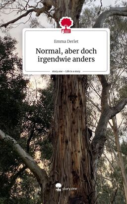

+++
title = "Normal, aber doch irgendwie anders"
date = "2024-03-13"
draft = false
pinned = false
tags = ["Autismus", "Anders"]
image = "normal-aber-doch-irgendwie-anders-life-is-a-story-story-one-gebundene-ausgabe-emma-derlet-1-.jpeg"
+++
Was genau bedeutet es autistisch zu sein? Dieses Buch erklärt in einfacher Sprache, wie es sich anfühlt die Welt anders zu empfinden. Diese Worte sind an alle Menschen gerichtet, die mit einer etwas anderen Wahrnehmung leben oder solche, die dieses Thema verstehen wollen.

Link zum Buch:

https://www.orellfuessli.ch/shop/home/artikeldetails/A1069676528