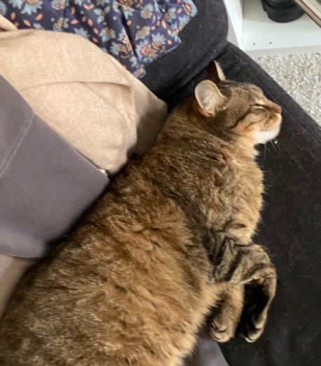

+++
title = "Test"
date = "2024-03-05"
draft = false
pinned = false
tags = ["test", "ideen", ""]
image = "img_1975.png"
description = "This is a test"
footnotes = "Hier kann man irgendwas schreiben"
+++
This is a test

