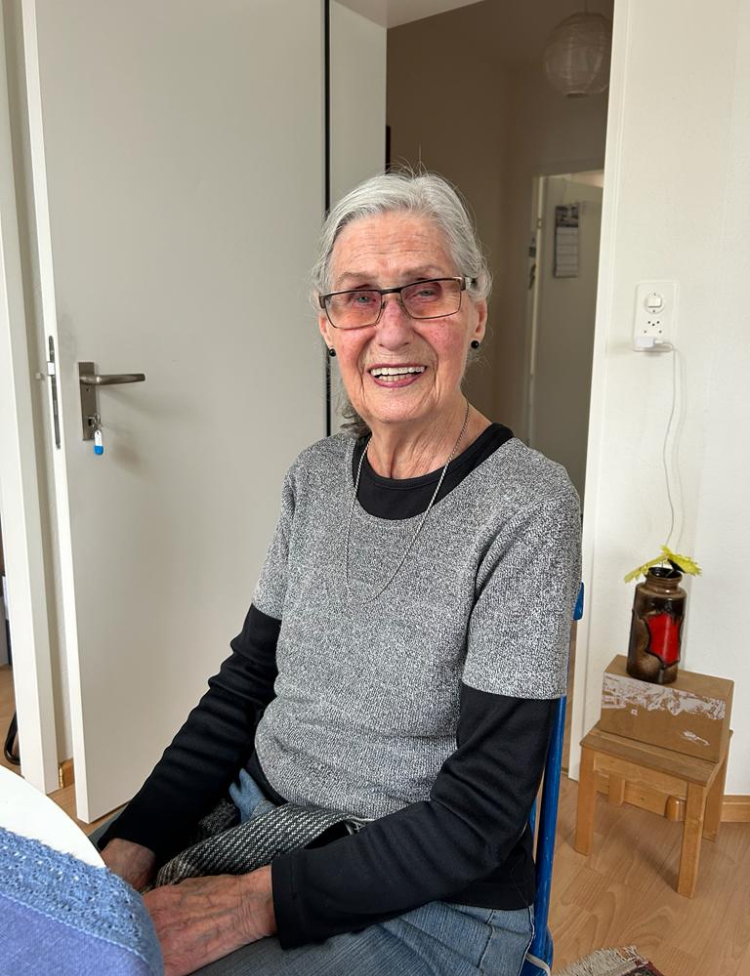

+++
title = "Von der Schweiz ins Down-Under"
date = "2024-04-23"
draft = false
pinned = false
tags = ["Melbourne", "Australien", "Auswandern", "Migration"]
image = "img_0748.jpeg"
+++


Nach dem 2. Weltkrieg zog es viele Europäer nach Australien auf der Suche nach Stabilität und neuen Chancen. Das Land versprach Arbeit, was zahlreiche Hoffnungsvolle aus Europa anzog, darunter Marlene Derlet und ihr Mann Anton. Aber wie ist es, alles hinter sich zu lassen und komplet neu anzufangen? Marlene teilt ihre Erfahrungen über das Leben in einem neuen Land, von den kleinen Freuden des Alltags bis zu den großen Herausforderungen.





Viele Menschen wandern in den 60er Jahren nach Australien aus, weil das Land zu dieser Zeit eine gezielte Einwanderungspolitik hat und Arbeitskräfte in verschiedenen Sektoren benötigt. Von 1851 bis Ende der 1860er-Jahre spielte aber auch der Victorianische Goldrausch eine grosse Rolle. Innerhalb von nur zehn Jahren verdreifachte sich die Bevölkerung Australiens deswegen. Diese Gründe überzeugten auch Marlene und Anton in dieses vielversprechende Land zu immigrieren.



An diesem Morgen setzt sich Marlene Derlet in Basel in den Zug und fährt bis nach Bern. Vom Bahnhof Bern aus sind es zehn Minuten zu Fuss bis sie das Marzilli-Quartier erreicht. Angekommen setzt sich die 87-jährige Marlene in einen schwarzen Sessel. Draussen weht ein sanfter Wind, die ersten grünen Blätter wachsen heran. Der Frühling kommt! Durch die grossen Fenster im Wohnzimmer wirft die Mittagssonne warme Lichtstrahlen herein. Mit Spannung und einem Gefühl von Vorfreude fängt Marlene an zu erzählen.

Der Anfang

In den 1960er Jahren hat jeder über das Leben in Australien geschwärmt, die Wärme, die Sonne, die Menschen. Auch Marlene und ihr Ehemann Anton wollen an die Wärme ziehen, daher machen sie sich am 18. April 1960 mit dem Schiff auf den Weg. Das Schiff Johan van Oldenbarnevelt, ein Migrantenschiff, hat Platz für 770 Passagiere. Von Genua aus sticht das Passagierschiff zu einer fünfwöchigen Reise auf See. Marlene leidet unter der Seekrankheit, doch auf dem Schiff gibt es viele Möglichkeiten sich abzulenken. Als das Ehepaar am 16. Mai 1960 in Melbourne, der zweitgrössten Stadt Australiens, ankommt, werden sie von polnischen Freunden erwartet. Die Bekanntschaft führt Marlene und Anton direkt zu einem neu eröffnetem Kaffeeladen. Erschöpft von der Reise, trinken sie ihren ersten Cappuccino, welcher nur in diesem Kaffeeladen serviert wird. Die weiteren Wochen verbringt das Paar in einer Unterkunft von Freunden, die sie auf dem Schiff kennengelernt haben. Zimmer oder Wohnungen werden oft von Einwohnern an Migranten vermietet. Marlenes erster Eindruck von Melbourne ist positiv. Sie fühlt sich schnell wohl in dem für sie noch fremden Land.

Das Geräusch einer Katze, die durch die offene Türe hereinkommt, reißt Marlene aus ihren Erzählungen. Eine kleine getiegerte Katze mit einem golden leuchtenden Bauch setzt sich auf das Sofa und streckt sich genüsslich aus. Draussen, bewegen sich die Äste der Bäume. Die jungen, frischen Blätter tanzen im Licht der Mittagssonne, ein Anblick. Marlene lächelt, als sie die Katze betrachtet, und setzt ihre Erzählung fort.

Der Alltag

> Ich wollte nicht zurück in die Schweiz. Ich wollte das Land entdecken.

In den 60er Jahren wandern wegen des Goldrausches viele Menschen nach Viktoria/Australien aus. Allein im Jahr 1960 verlassen ungefähr 105.000 Menschen ihr Zuhause, um nach Australien zu ziehen. Auch Anton versucht sein Glück mit Goldsuchen. Doch das gefundene Gold reicht nicht, um den Lebensunterhalt zu bestreiten. Deswegen sucht das Paar nach der Einreise eine Arbeit. Ein Job zu finden, stellt sich als einfach heraus, denn Australien braucht Arbeiter. Die freie Stelle in einer Buchhandlung kommt Marlene gerade recht. Während Marlene Bücher verkauft, arbeitet Anton in einer Autofabrik. Nur drei Tage braucht Anton, um diesen Job zu finden. Bald darauf, nach einigen Jahren harter Arbeit, kann Anton seine eigenen Fabriken eröffnen. An die australische Kultur passen sich Marlene und Anton ziemlich gut an.  Marlene sitzt in einem schwarzen Sessel, ihre langen Haare fallen lose über ihre Schultern. Die warme Mittagssonne strahlt durch die großen Fenster des Wohnzimmers und taucht den Raum in ein goldenes Licht. Während sie erzählt, leuchten ihre Augen, und ein sanftes Lächeln spielt auf ihren Lippen. „Die Australier sind so freundlich“, beginnt sie, ihre Stimme ist warm und nostalgisch. „Ganz anders als die Schweizer. Die Menschen dort sind offen, hilfsbereit und immer gut gelaunt.“ Sie lehnt sich zurück, ihre Hände ruhen entspannt in ihrem Schoß. „Ich erinnere mich an die leichten Sommerbrisen, die durch die Straßen Melbournes wehten, den Duft von frischem Eukalyptus des kalten Regenwaldes in der Luft und die Wärme der Sonne auf meiner Haut.“ Ihre Worte malen ein lebendiges Bild der australischen Gastfreundschaft und der sonnigen Tage. Jedoch verursachen die Essgewohnheiten der australischen Küche dem Paar Schwierigkeiten. Es dauert einige Tage, um geeignetes Essen zu finden, damit sie sich wohl fühlen. Die verschiedenen schweizer Bäckereien erleichtern ihnen die Angewöhnung an das fremde Land. Obwohl das Einleben positiv verläuft, gibt es während dem  Alltag trotzdem kleine Missverständnisse. Zum Beispiel als ein paar Freunde Marlene fragen, ob sie ein Teller zu der Garten Party bringen könnten. Gesagt getan, bringt Marlene einen Teller mit. Gemeint war jedoch einen Teller mit Essen. 

Das Studium

> Sowas hätte ich nie in der Schweiz erlebt!

Etwas später beschließt Marlene Derlet, ein Studium aufzunehmen. „Es war unglaublich, dass Frauen in Australien gratis studieren dürfen“, erzählt sie begeistert. Marlene wählt Linguistik, Sprachpsychologie und Anthropologie an der Monash University in Melbourne. Später interessiert sie sich jedoch vermehrt für die Ureinwohner Australiens. Eine Studienkollegin, welche englische und von den Ureinwohnern stammende Wurzeln hat,  darf als erste Aborigine das Department of Koori Research Centre übernehmen. Der Name Koori ist die alte Bezeichnung für die Ureinwohner Australiens. Diese Menschen halten sich zu dieser Zeit nicht auf den Strassen oder in den Städten auf, da sie in verschiedenen Reservaten gehalten werden. Somit reisen die beiden Frauen mit kleinen Flugzeugen durch ganz Australien, um die verschiedenen Stämme in den Reservaten zu besuchen. Die Rechte der Aborigines sind Marlene genauso wichtig wie die Rechte der Frauen. Ihre Liebe zum Schreiben hilft ihr dabei, ihre Gefühle über die Wichtigkeit der Frauenrechte auszudrücken. So entstehen zwei Bücher: Das Buch "Talking up a storm" (1993) handelt von neun Frauen und ihren Diskussionen über Frauenrechte. Das zweite Buch heißt "Invisible Woman of Prehistory" (2013) und handelt von der allgemeinen Geschichte der Frauen auf der Welt.

Die Rückkehr

Im Jahr 1968 kommt der Sohn Peter auf die Welt. Peter absolviert die Schulbildung in Melbourne, studiert Physik  und findet eine offene Stelle als Wissenschaftler in Norwegen. Aufgrund einer spannenden akademischen Stelle zieht er später in das Heimatland seiner Mutter. Er verliebt sich und gründet eine Familie in der Schweiz. Marlene und Anton haben sich in dieser Zeit entschieden ihre eignen Wege zu gehen. Marlene zieht in eine kleine Wohnung in St. Kilda, in der Nähe des Meeres. Als dann 2007 das erste Enkelkind zur Welt kommt, ist es klar für sie, dass sie zurückkehren will. „Mit 72 Jahren trat ich die Reise zurück in die Schweiz an. Es war eine viel kürzere und angenehmere Reise als damals mit dem Schiff“, sagt sie schmunzelnd.

Nun lebt Marlene seit 17 Jahren, ohne es zu bereuen, in der Schweiz. Jedoch sagt sie herzlich und mit einem Hauch von Sehnsucht, dass sie das Land und die Kultur Australiens sehr vermisst. Vor allem dann kommt Heimweh auf, wenn ihre Familie nach Melbourne reist, um Anton zu besuchen. Marlene freut sich jedes Mal darauf ihre Enkelkinder zu sehen, wenn sie von Basel nach Bern kommt. So wie auch heut. Soeben läutet die Kirchenglocke zum Mittag und die ersten Kinderstimmen sind von der Strasse zu hören. In diesem Moment überkommt Marlene ein Gefühl der Zufriedenheit, während sie die Geräusche der Schweizer Stadt genießt und gleichzeitig die Erinnerungen an ihre Heimat in Australien lebendig werden lässt.